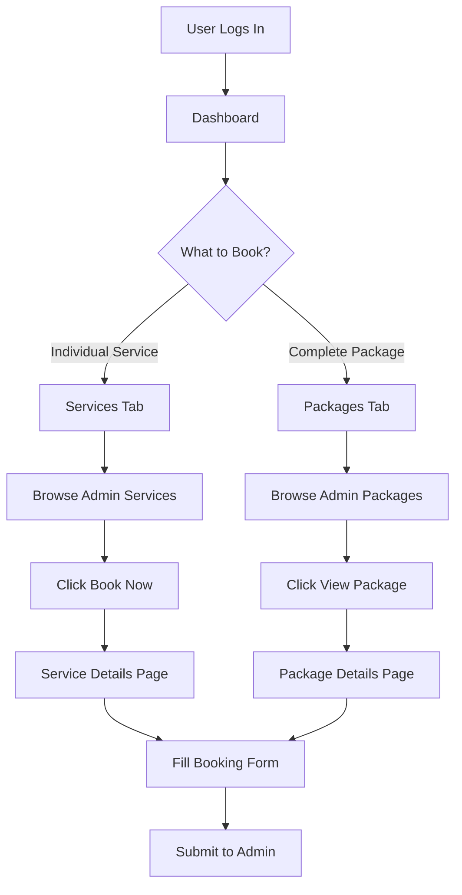

# ✅ User Navigation Updated

## 🎯 Changes Made

Updated the user dashboard navigation menu to remove "Vendors" and add "Packages".

---

## 📊 Navigation Changes

### **Before:**
```
┌──────────────────────────────────────────┐
│  Dashboard  │  Services  │  Vendors     │
└──────────────────────────────────────────┘
```

### **After:**
```
┌──────────────────────────────────────────┐
│  Dashboard  │  Services  │  Packages    │
└──────────────────────────────────────────┘
```

---

## 🔄 Updated Links

### **Desktop Navigation** (Lines 54-66)
```typescript
{user.role === 'user' && (
  <>
    <Link href="/dashboard/user">
      Dashboard
    </Link>
    <Link href="/services">
      Services                    // Admin services only
    </Link>
    <Link href="/events">
      Packages                    // NEW! Admin packages
    </Link>
  </>
)}
```

### **Mobile Navigation** (Lines 161-176)
```typescript
{user.role === 'user' && (
  <>
    <Link href="/dashboard/user">
      Dashboard
    </Link>
    <Link href="/services">
      Services                    // Admin services only
    </Link>
    <Link href="/events">
      Packages                    // NEW! Admin packages
    </Link>
  </>
)}
```

---

## 📁 File Modified

**File**: `smarteventx-v2/src/app/dashboard/layout.tsx`

**Changes**:
1. ❌ Removed "Vendors" link (`/vendors`)
2. ✅ Added "Packages" link (`/events`)
3. ✅ Kept "Services" link (`/services` - shows admin services only)
4. ✅ Kept "Dashboard" link (`/dashboard/user`)

---

## 🎨 Navigation Structure

### **User Navigation Tabs:**

| Tab | Link | Shows |
|-----|------|-------|
| **Dashboard** | `/dashboard/user` | User dashboard with stats, bookings, admin services |
| **Services** | `/services` | All admin individual services (filtered by no vendor) |
| **Packages** | `/events` | All admin packages/events |

### **Hidden from Users:**
- ❌ Vendors page
- ❌ Vendor services
- ❌ Vendor profiles

---

## 🔍 What Each Tab Shows

### **1. Dashboard** (`/dashboard/user`)
- Stats: Available Packages, Completed Bookings, Pending Payments, Admin Services
- Browse Admin Packages section
- Recent Bookings
- Admin Services grid (NEW!)
- Popular Packages sidebar

### **2. Services** (`/services`)
- Grid/list of all admin services
- Filter by category
- Search functionality
- Service details (name, price, description)
- Book Now button for each service

### **3. Packages** (`/events`) - NEW!
- Grid/list of all admin packages
- Each package shows included services
- Package pricing
- View Package button
- Full package details page

---

## 🚀 User Journey



---

## ✅ Business Model Compliance

### **Correct Implementation:**
- ✅ Users see Dashboard, Services, Packages
- ✅ Services = Admin services only (no vendor)
- ✅ Packages = Admin packages/events
- ✅ Vendors completely hidden from users
- ✅ Users book from admin only

### **What Users DON'T See:**
- ❌ Vendors tab
- ❌ Vendor profiles
- ❌ Vendor services
- ❌ Direct vendor booking

---

## 🔄 Navigation Flow

### **From Dashboard:**
```
Dashboard → See admin services/packages
         → Click "View All Services" → Services tab
         → Click "View All Packages" → Packages tab
```

### **From Services:**
```
Services → Browse all admin services
        → Click service → Service details page
        → Book service → Booking form
```

### **From Packages:**
```
Packages → Browse all admin packages
        → Click package → Package details page
        → See included services → Booking form
```

---

## 📱 Responsive Design

### **Desktop Navigation:**
- Horizontal layout
- All 3 tabs visible
- Blue buttons with hover effects

### **Mobile Navigation:**
- Hamburger menu
- Vertical list
- Same 3 tabs
- Settings and Logout at bottom

---

## 🎨 Visual Design

### **Button Style:**
```css
bg-blue-600           /* Blue background */
hover:bg-blue-700     /* Darker blue on hover */
text-white            /* White text */
px-3 py-2            /* Padding */
rounded-md           /* Rounded corners */
```

### **Active State:**
- Same blue styling
- Font weight: medium
- Smooth transitions

---

## 🧪 Testing Steps

### **1. View Navigation:**
```bash
1. Login as user
2. Check top navigation bar
3. Verify 3 tabs: Dashboard, Services, Packages
4. Verify NO "Vendors" tab
```

### **2. Test Each Tab:**
```bash
# Dashboard Tab
- Click "Dashboard"
- Verify user dashboard loads
- Check stats cards
- Check admin services section

# Services Tab
- Click "Services"
- Verify admin services page loads
- Check only services without vendor shown
- Test service details

# Packages Tab
- Click "Packages"
- Verify admin packages page loads
- Check package list
- Test package details
```

### **3. Test Mobile:**
```bash
1. Resize browser to mobile width
2. Click hamburger menu
3. Verify 3 tabs visible
4. Test each tab navigation
5. Verify Settings and Logout at bottom
```

---

## 📊 Summary

| Item | Before | After |
|------|--------|-------|
| **Dashboard Tab** | ✅ | ✅ |
| **Services Tab** | ✅ (vendor services) | ✅ (admin services) |
| **Vendors Tab** | ✅ | ❌ REMOVED |
| **Packages Tab** | ❌ | ✅ NEW |
| **Total Tabs** | 3 | 3 |

---

## ✅ Verification

- [x] Removed "Vendors" link from desktop navigation
- [x] Removed "Vendors" link from mobile navigation
- [x] Added "Packages" link to desktop navigation
- [x] Added "Packages" link to mobile navigation
- [x] "Services" still available (shows admin services)
- [x] "Dashboard" still available
- [x] No TypeScript errors
- [x] Responsive design maintained

---

## 🎯 Key Points

1. **Vendors are hidden** - Users cannot access vendor pages
2. **Services = Admin only** - Only services without vendor shown
3. **Packages = Admin packages** - Admin-created event packages
4. **Navigation is clean** - Only 3 relevant tabs for users
5. **Business model correct** - Users → Admin → Vendors (users don't see vendors)

---

**Status**: ✅ Complete  
**File Modified**: `src/app/dashboard/layout.tsx`  
**Lines Changed**: 8 lines (4 desktop + 4 mobile)  
**TypeScript Errors**: None  
**Ready to Test**: Yes

---

**Next Step**: Restart the development server to see the changes!

```bash
# Stop current server (Ctrl+C)
# Then restart:
cd smarteventx-v2
npm run dev
```
